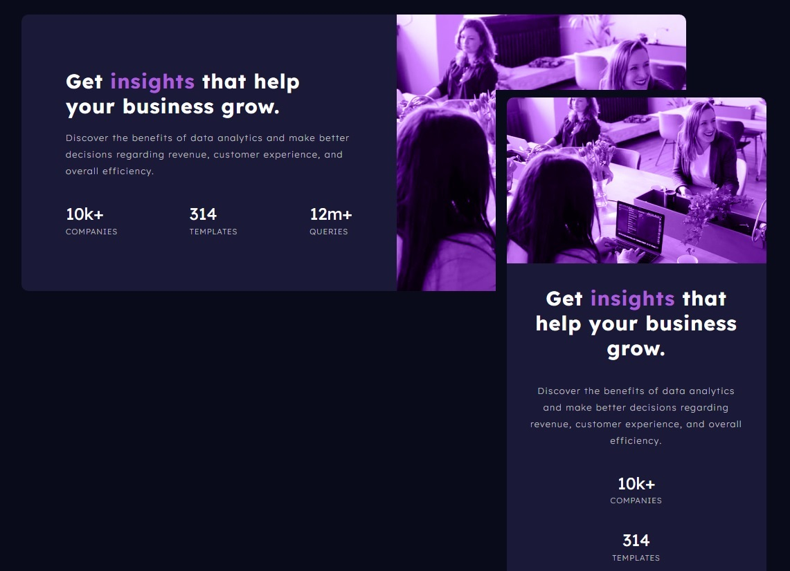

# Frontend Mentor - Stats preview card component main

## 🖥️ O Projeto
Esse é um protótipo Web Responsivo para exibir as informações de uma determinada Empresa.
 

## 🚀 Tecnologias
Esse protótipo foi desenvolvido com as seguintes tecnologias:

- HTML5
- CSS3
- Git e Github
